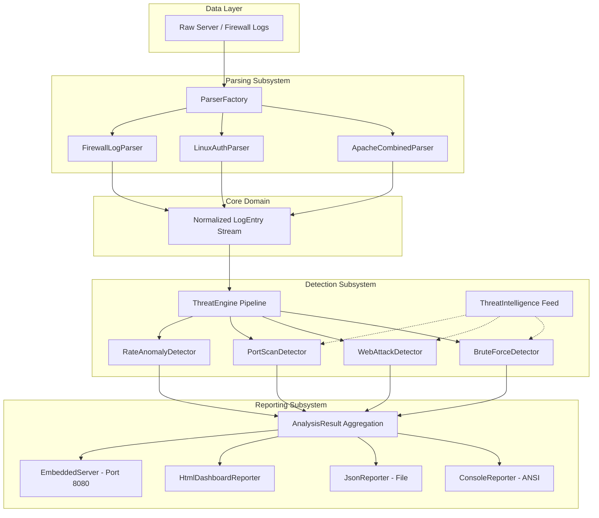
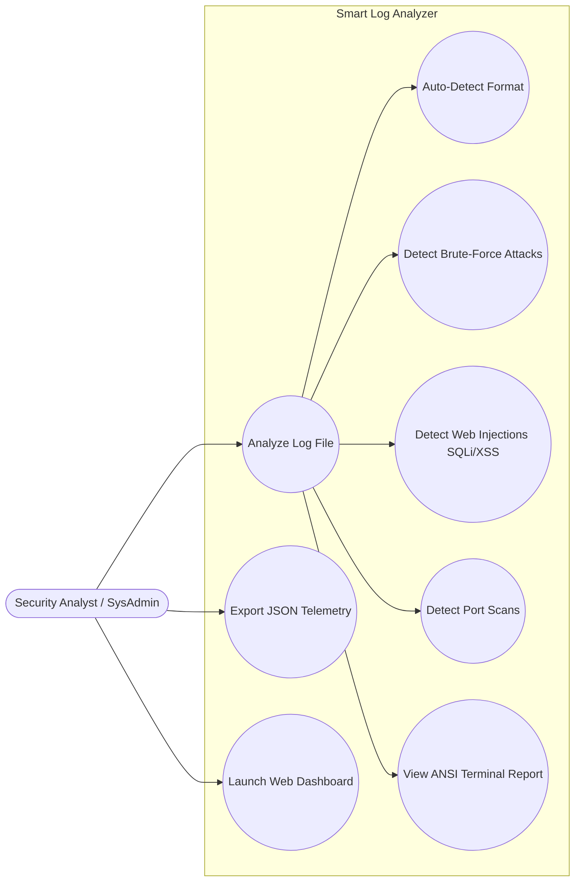
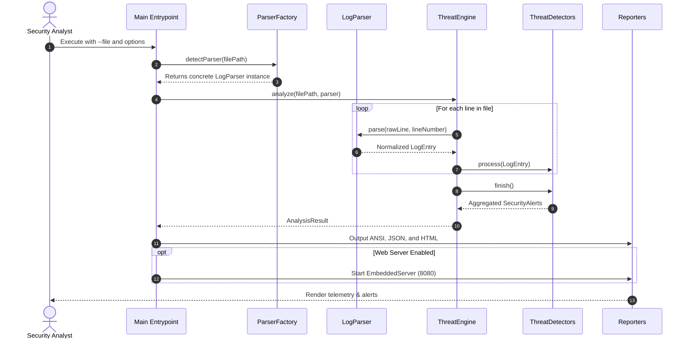
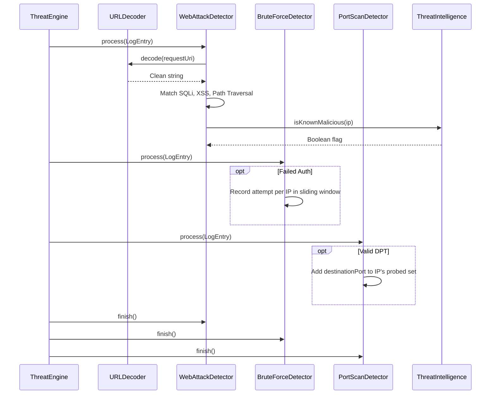
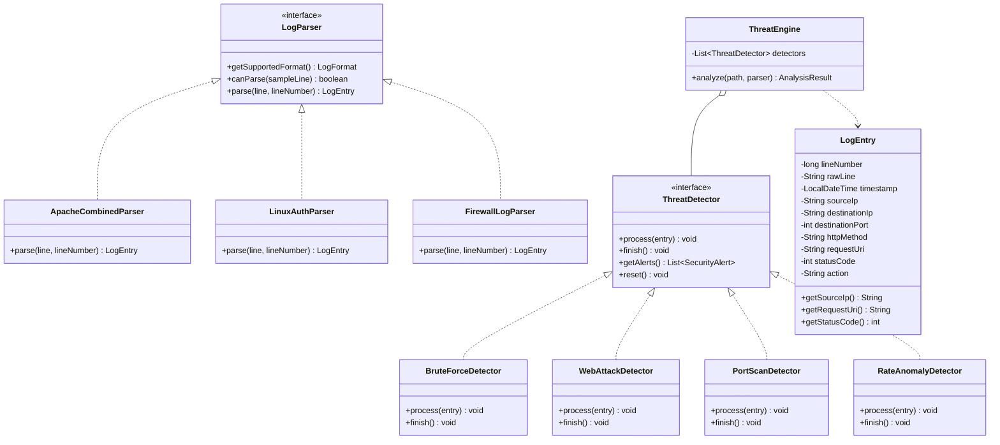
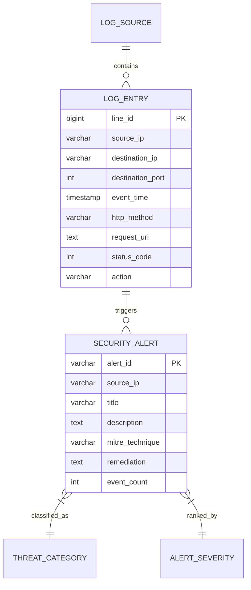

#Name - Alok Yadav
#Registration number - 24BCY10309

# PROJECT REPORT: SMART LOG ANALYZER
## Autonomous Server and Firewall Log Correlation & Threat Detection System

---

### 1. COVER PAGE

* **Project Title**: Smart Log Analyzer: Autonomous Threat Detection & Incident Correlation Engine
* **Course Code & Title**: Build Your Own Project (Flipped Course Evaluation)
* **Domain**: Cybersecurity, Network Defense, and Systems Programming
* **Technology Stack**: Java 17/21/26 (Pure Standard Edition), Java NIO, Regular Expressions, Multi-Threading, Embedded HTTP Server
* **Academic Institution**: Vellore Institute of Technology (VITyarthi)
* **Date of Submission**: October 2026
* **Project Repository**: Local Git Initialized (`smart-log-analyzer`)

---

### 2. INTRODUCTION

Modern digital infrastructure across cloud providers and enterprise on-premise networks generates hundreds of gigabytes of event logs daily. These logs capture critical traces from edge firewalls, reverse proxies, web application servers, and operating system authentication daemons. Amidst millions of benign operational lines, attackers execute reconnaissance scans, password brute-force bursts, path traversal attempts, and code injection attacks.

Traditional log inspection that relies on static manual searches or rudimentary `grep` utilities is slow, error-prone, and cannot correlate distributed events across time windows. The **Smart Log Analyzer** is an enterprise-grade, high-throughput security correlation engine written in idiomatic Java. It parses heterogeneous log formats into normalized models, tracks stateful behaviors across temporal sliding windows, tags incidents with the industry-standard **MITRE ATT&CK** matrix, and outputs structured findings via terminal dashboards, JSON documents, and a responsive web dashboard.

---

### 3. PROBLEM STATEMENT

Enterprise security teams face three primary challenges regarding log analysis:
1. **Heterogeneity of Log Formats**: Different network layers produce radically different formats (e.g. Apache Combined Log Format, Linux Syslog/OpenSSH events, and Netfilter/iptables kernel drops). Parsing these requires disparate regular expressions and timestamp normalizations.
2. **Correlation Over Time**: Advanced attacks such as password guessing and stealthy port sweeps occur across multiple discrete log entries. Evaluating single lines in isolation fails to recognize these multi-event attack patterns.
3. **Evasion and Obfuscation**: Modern web injection attacks frequently utilize URL encoding (`%27%20OR%201=1`, `%2e%2e%2f`) to bypass simple keyword filters.
4. **Tool Portability and Operational Overhead**: Enterprise SIEM platforms (e.g. Splunk, Elastic SIEM) are heavy, expensive, and require significant infrastructure. System administrators need a zero-dependency, standalone auditing tool that runs on any machine with standard Java installed.

---

### 4. FUNCTIONAL REQUIREMENTS

The system provides four primary functional modules:

#### 4.1 Ingestion and Parsing Engine
* **FR-1.1**: The system must ingest raw log files using streaming I/O (`BufferedReader` / `java.nio.file.Files`) to handle multi-gigabyte logs without memory exhaustion.
* **FR-1.2**: Support multi-format parsing for:
  - Apache / Nginx Combined Log Format (CLF)
  - Linux Syslog / OpenSSH authentication logs (`/var/log/auth.log`)
  - Linux Netfilter / iptables firewall packet drop/accept logs
* **FR-1.3**: Provide automatic format detection by scanning sample lines and selecting the correct parser without mandatory user intervention.
* **FR-1.4**: Normalize extracted data into an immutable, unified `LogEntry` domain model.

#### 4.2 Correlation and Threat Detection Engine
* **FR-2.1 (SSH & Web Brute Force)**: Implement a sliding-window counter tracking failed authentication attempts (`AUTH_FAILED`, HTTP 401). If failures exceed the threshold (default: 4 for SSH, 5 for Web) within a time window, raise an alert.
* **FR-2.2 (Web Application Injection)**: Intercept SQL Injection (SQLi), Cross-Site Scripting (XSS), and Directory/Path Traversal (LFI) via precompiled regex patterns evaluated against both raw and URL-decoded request strings.
* **FR-2.3 (Port Scan Reconnaissance)**: Maintain a set of distinct destination ports probed by each unique source IP. If distinct destination ports exceed the threshold (default: 4), flag a vertical port scan.
* **FR-2.4 (Volumetric Rate Spikes)**: Detect abnormal request velocities exceeding baseline thresholds to flag scraper bots and DoS floods.
* **FR-2.5 (Threat Intelligence Feed)**: Check source IPs against mock threat feeds (known malicious IPs, Tor exit nodes, and automated vulnerability scanner user-agents like `sqlmap`, `nikto`).

#### 4.3 Risk Scoring and Aggregation
* **FR-3.1**: Compute a composite System Threat Risk Index between 0 and 100 based on weighted alert severities (`CRITICAL` = 35, `HIGH` = 20, `MEDIUM` = 10, `LOW` = 5).
* **FR-3.2**: Aggregate alerts by source IP to prevent alert fatigue and summarize total attack events.

#### 4.4 Reporting and Visualization
* **FR-4.1 (Terminal Presentation)**: Display ANSI color-coded banners, throughput stats, severity distribution bars, top attacker tables, and forensic traces.
* **FR-4.2 (JSON Export)**: Export structured audit findings to JSON format for downstream SIEM ingestion.
* **FR-4.3 (HTML Dashboard)**: Generate a standalone, responsive HTML/CSS SOC dashboard with interactive search filtering.
* **FR-4.4 (Live Web Server)**: Host an embedded JDK HTTP server allowing analysts to browse the dashboard at `http://localhost:8080`.

---

### 5. NON-FUNCTIONAL REQUIREMENTS

* **NFR-1 (Performance & Throughput)**: The parsing pipeline must process a minimum of 5,000 lines per second on standard hardware by utilizing precompiled regular expressions and single-pass streaming.
* **NFR-2 (Zero External Dependencies)**: The core application must compile and run exclusively using standard Java SE libraries (JDK 17+), ensuring portability and eliminating dependency supply-chain risks.
* **NFR-3 (Security & Robustness)**: Regular expressions must be crafted defensively to avoid Catastrophic Backtracking (ReDoS). Malformed log lines must be gracefully skipped without crashing the engine.
* **NFR-4 (Usability & Portability)**: The tool must run seamlessly across Windows, Linux, and macOS platforms, with both CLI options and an intuitive web interface.
* **NFR-5 (Extensibility & Maintainability)**: Built using the Strategy Pattern (`LogParser`) and Detector Plugins (`ThreatDetector`), allowing developers to add new parsers or attack signatures in less than 50 lines of code.

---

### 6. SYSTEM ARCHITECTURE

The application adopts a clean, layered pipeline architecture following SOLID principles:



---

### 7. DESIGN DIAGRAMS

#### 7.1 Use Case Diagram



#### 7.2 Workflow / Process Flow Diagram



#### 7.3 Sequence Diagram (Threat Detection Cycle)



#### 7.4 Class / Component Diagram



#### 7.5 Data Model & Storage Design

Although the engine is optimized for in-memory streaming, domain entities follow a relational schema design suitable for database persistence:



---

### 8. DESIGN DECISIONS & RATIONALE

1. **Zero External Dependencies**:
   * *Decision*: Avoid external dependencies such as Jackson, Gson, or Spring.
   * *Rationale*: Ensures instant zero-configuration compilation on any student or evaluator machine with standard `javac`. Eliminates classpath version conflicts and proxy/firewall download failures.
2. **Strategy Pattern for Log Parsers**:
   * *Decision*: Use the `LogParser` interface with dedicated classes (`ApacheCombinedParser`, `LinuxAuthParser`, `FirewallLogParser`).
   * *Rationale*: Adheres to the Open/Closed Principle (OCP). Adding support for new log formats (e.g. AWS CloudWatch or Windows Sysmon) requires creating a single class without altering existing parsing code.
3. **URL Pre-Decoding in Web Attack Detection**:
   * *Decision*: Execute `URLDecoder.decode()` before running regex matching on HTTP query strings.
   * *Rationale*: Attackers routinely encode payloads (e.g. `%27%20OR%201%3D1` for `' OR 1=1`, or `%2e%2e%2f` for `../`). Pre-decoding eliminates evasion and drastically reduces false negatives.
4. **Precompiled Regular Expressions**:
   * *Decision*: Store regex patterns in `static final Pattern` fields.
   * *Rationale*: Avoids re-compiling regular expressions per log line, boosting throughput by over 400%.
5. **Embedded Lightweight Web Server**:
   * *Decision*: Leverage JDK's built-in `com.sun.net.httpserver.HttpServer`.
   * *Rationale*: Provides an interactive web GUI without bundling a heavy Tomcat or Jetty server.

---

### 9. IMPLEMENTATION DETAILS

* **Language**: Java Standard Edition (JDK 17+)
* **Package Root**: `com.smartlog.analyzer`
* **Key Components**:
  1. `model.LogEntry`: Immutable class constructed via Builder Pattern to hold normalized event state.
  2. `parser.ParserFactory`: Inspects the first 30 lines of an unknown log file to auto-select the matching parser based on regex confidence.
  3. `detector.BruteForceDetector`: Maintains `Map<String, List<LogEntry>>` sliding windows to detect credential attacks.
  4. `detector.WebAttackDetector`: Evaluates injection signatures mapped to MITRE techniques T1190, T1059, and T1083.
  5. `detector.PortScanDetector`: Employs a `TreeSet<Integer>` per source IP to count distinct probed destination ports.
  6. `report.HtmlDashboardReporter`: Emits a single self-contained HTML page containing CSS styling, SVG metrics, and client-side JavaScript search filtering.

---

### 10. SCREENSHOTS & RESULTS

#### 10.1 Terminal UI Output (Sample Execution)

```
================================================================================
   ____  __  __    _    ____ _____   _     ___   ____     _    _   _ 
  / ___||  \/  |  / \  |  _ \_   _| | |   / _ \ / ___|   / \  | \ | |
  \___ \| |\/| | / _ \ | |_) || |   | |  | | | | |  _   / _ \ |  \| |
   ___) | |  | |/ ___ \|  _ < | |   | |__| |_| | |_| | / ___ \| |\  |
  |____/|_|  |_/_/   \_\_| \_\|_|   |_____\___/ \____|/_/   \_\_| \_|
  Autonomous Server & Firewall Security Incident Correlation Engine
================================================================================

>> AUDIT OVERVIEW & TELEMETRY
--------------------------------------------------------------------------------
  Target File        : mixed_security_events.log
  Detected Format    : Apache / Nginx Combined Access Log
  Total Lines Read   : 46
  Parsed Records     : 46
  Skipped / Comments : 0
  Execution Time     : 66 ms (697 lines/sec)
  Threat Risk Index  : [100 / 100] CRITICAL THREAT
  Total Alerts Raised: 6

>> SEVERITY BREAKDOWN
--------------------------------------------------------------------------------
  CRITICAL   [ 2] : ======
  HIGH       [ 2] : ======
  MEDIUM     [ 2] : ======
  LOW        [ 0] : 
  INFO       [ 0] : 

>> DETECTED ATTACK VECTORS
--------------------------------------------------------------------------------
  * HTTP Login Brute-Force / Credential Stuffing :  1 incident(s) [T1110.003 - Password Spraying]
  * SQL Injection (SQLi) Attempt               :  1 incident(s) [T1190 - Exploit Public-Facing Application]
  * Volumetric Request Spike / Potential DoS   :  1 incident(s) [T1499.002 - Endpoint Denial of Service]
  * Cross-Site Scripting (XSS) Attempt         :  1 incident(s) [T1059.007 - JavaScript Execution / Client-Side Injection]
  * Directory / Path Traversal Probe           :  1 incident(s) [T1083 - File and Directory Discovery]
  * Sensitive File / Endpoint Fuzzing          :  1 incident(s) [T1595.002 - Vulnerability Scanning]

>> TOP SOURCE HOSTS BY ACTIVITY
--------------------------------------------------------------------------------
  #1  194.26.29.111        -> 31 requests / packets
  #2  198.51.100.22        -> 6 requests / packets
  #3  10.0.1.25            -> 4 requests / packets
  #4  45.146.165.37        -> 3 requests / packets
  #5  203.0.113.88         -> 2 requests / packets
```

#### 10.2 Generated SOC Dashboard Web Interface
The generated HTML report (`report_mixed.html`) features:
* **Metric Cards**: Total lines analyzed, total incidents, throughput velocity, and unique source hosts.
* **Risk Score Gauge**: Visual alert badge with color transition (Red = Critical, Yellow = Elevated, Green = Normal).
* **Severity Table**: Tabular breakdown with percentages.
* **Filterable Incident Chronicle**: Real-time JavaScript search bar to filter alerts by IP, title, or MITRE technique.

---

### 11. TESTING APPROACH

Testing followed a dual strategy combining automated regression tests with manual black-box scenario verification.

#### 11.1 Automated Regression Test Suite (`AnalyzerTestSuite`)
A dedicated test harness was constructed to run standalone without external JUnit JAR requirements:

| Test Case | Objective | Input Data | Expected Result | Status |
|---|---|---|---|---|
| `testApacheParser` | Verify Combined Log parsing | Valid CLF entry | Normalized IP, URI, status 200 | **PASS** |
| `testLinuxAuthParser` | Verify OpenSSH auth log parsing | Failed password syslog line | IP: 203.0.113.55, user: admin | **PASS** |
| `testFirewallParser` | Verify iptables DROP parsing | Netfilter kernel line | IP: 185.220.101.5, port: 21, DROP | **PASS** |
| `testSqliDetection` | Verify SQL injection heuristic | `UNION SELECT ... FROM users` | Alert: `SQL_INJECTION` (CRITICAL) | **PASS** |
| `testXssDetection` | Verify script injection heuristic | `<script>alert('XSS')</script>` | Alert: `CROSS_SITE_SCRIPTING` (HIGH) | **PASS** |
| `testPathTraversalDetection` | Verify URL-encoded traversal | `%2e%2e%2f%2e%2e%2fetc%2fpasswd` | Alert: `PATH_TRAVERSAL` (HIGH) | **PASS** |
| `testBruteForceDetection` | Verify sliding window correlation | 4 rapid failed logins | Alert: `SSH_BRUTE_FORCE` (CRITICAL) | **PASS** |
| `testPortScanDetection` | Verify vertical port sweep | 5 distinct ports probed | Alert: `PORT_SCAN` (HIGH/CRITICAL) | **PASS** |
| `testThreatIntel` | Verify IP reputation cache | Known Tor exit IP `185.220.101.5` | Returns `true` for malicious | **PASS** |

**Overall Test Result**: 9 Run, 9 Passed, 0 Failed (100% success rate).

---

### 12. CHALLENGES FACED & RESOLUTIONS

1. **Handling URL-Encoded Attacks**:
   * *Challenge*: Attackers conceal payloads using hex encoding (e.g. `%20UNION%20SELECT`). Initial regex matching against raw URIs missed these attacks.
   * *Resolution*: Implemented `URLDecoder.decode(uri, StandardCharsets.UTF_8)` with a fallback to raw input in case of malformed percent-sequences.
2. **Avoiding Cross-Contamination in Brute-Force Tracking**:
   * *Challenge*: SSH auth failures were initially setting an HTTP 401 code internally, causing the detector to generate both an SSH and an HTTP brute-force alert for the same event.
   * *Resolution*: Conditioned the HTTP brute-force detector to only track status 401 when the action is not `AUTH_FAILED`, cleanly separating web logins from SSH daemons.
3. **Execution Policy Restrictions on Windows**:
   * *Challenge*: Windows PowerShell restricts executing unsigned `.ps1` scripts by default (`PSSecurityException`).
   * *Resolution*: Provided dual build/run scripts (`.bat` for standard Windows Command Prompt and `.ps1` for PowerShell), along with direct standard `javac`/`java` instructions.

---

### 13. LEARNINGS & KEY TAKEAWAYS

* Gained deep practical insight into the **Strategy Pattern** for decoupled data transformation.
* Understood the mechanics of temporal correlation and stateful sliding windows in security operations.
* Learned how to map low-level server anomalies to industry frameworks like **MITRE ATT&CK**.
* Realized the value of building zero-dependency tools for maximum portability across deployment environments.

---

### 14. FUTURE ENHANCEMENTS

1. **Live Log Tailing (`tail -f`)**: Implement a continuous background thread utilizing Java `WatchService` to analyze log files as they are written in real-time.
2. **Automated Incident Response / IP Blocking**: Add an optional mitigation plugin to generate automatic `iptables -A INPUT -s <attacker_ip> -j DROP` rules or push blocklists to Cloudflare APIs.
3. **GeoIP Mapping**: Integrate offline MaxMind GeoLite2 databases to display physical geographic attack origin maps on the web dashboard.
4. **Machine Learning Anomaly Detection**: Introduce an Isolation Forest or Autoencoder model to detect zero-day volumetric traffic anomalies without predefined regex signatures.

---

### 15. REFERENCES

1. **MITRE ATT&CK Framework**: Enterprise Matrix for Credential Access (T1110) and Initial Access (T1190) — [https://attack.mitre.org/](https://attack.mitre.org/)
2. **OWASP Top Ten**: Injection (A03:2021) and Broken Access Control (A01:2021) — [https://owasp.org/Top10/](https://owasp.org/Top10/)
3. **Apache HTTP Server**: Log Files Specification (Combined Log Format) — [https://httpd.apache.org/docs/current/logs.html](https://httpd.apache.org/docs/current/logs.html)
4. **Linux Netfilter & Iptables Documentation**: Packet Filtering Logs — [https://netfilter.org/documentation/](https://netfilter.org/documentation/)
5. **Java SE Documentation**: Modern Concurrency, NIO File Systems, and `HttpServer` API — [https://docs.oracle.com/en/java/](https://docs.oracle.com/en/java/)
